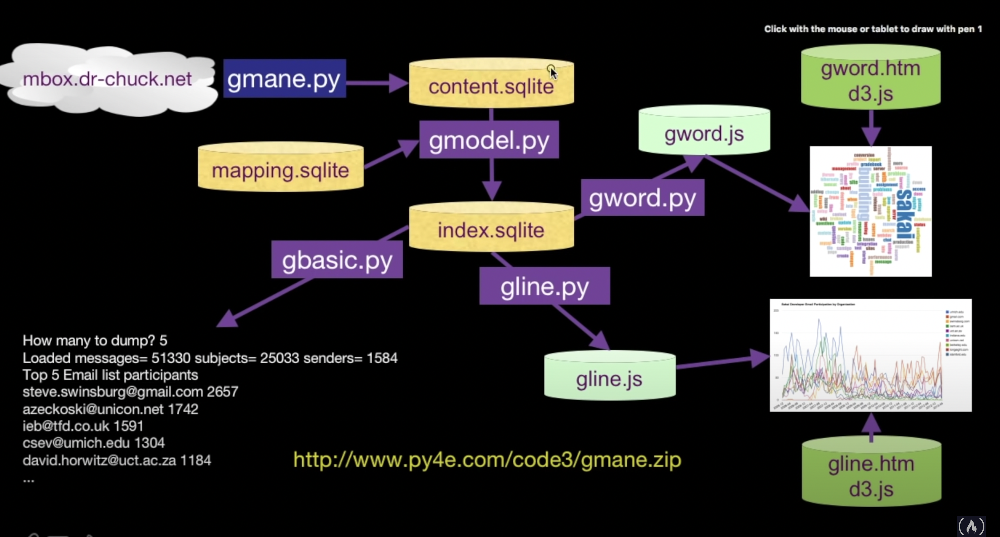

# data_visualization_project1
This repository contains the coursera capstone project for data visualisation

## data flow for data visualization

* gmane.py : it retreives, analyzes and parses tha data  from the website and stores emails data in `content.sqlite` database.

* content.sqlite :

| id | email | sent_at | subject | headers | body |
| ---- | ----  | ----  | ----  | ---- | ---- |

* gmode.py :  
